# 04 — Modelo de dados (lógico)

> Modelo **lógico** para validação funcional. Tipos, índices e nomes físicos serão fechados na estrutura definitiva.
> Convenção: todas as tabelas possuem `id`, `criado_em`, `criado_por`, `atualizado_em`, `atualizado_por`, `ativo` — omitidos abaixo.

## 1. Decisões estruturais (evitar duplicidade)

| # | Decisão | Motivo |
|---|---------|--------|
| E1 | **Catálogo único de atributos técnicos** (`atributos_tecnicos`) + aplicabilidade por categoria (`categoria_atributos`). | Um mesmo atributo (ex.: capacidade residual) é usado em requisitos, cotações, concorrentes, amostra e lote. Sem isso, cada tela teria seus próprios campos e a comparação seria impossível. |
| E2 | **`modelos_maquinas` unifica** modelos Forza, de fornecedores e de concorrentes (campo `origem`). | A ficha técnica é a mesma estrutura; comparações Forza × concorrente × fornecedor usam a mesma consulta. |
| E3 | `concorrentes` = **empresas**; os modelos dos concorrentes ficam em `modelos_maquinas` (origem CONCORRENTE); preços em `precos_concorrentes`. | Base histórica reaproveitável entre projetos. |
| E4 | Requisitos do projeto são **versionados** (`requisitos_versao` + `requisitos_projeto`). | Cotação precisa saber qual configuração foi pedida. |
| E5 | Nacionalização em **cabeçalho + itens**; cenários são cópias independentes. | Flexível para novos custos sem alterar estrutura; simulação não toca o oficial. |
| E6 | **Configuração homologada** versionada (`configuracao_homologada` + `configuracao_itens`). | Base única para SKU, docs, marketing, pedido e conferência do lote. |
| E7 | `anexos` e `historico_projeto` são **polimórficos** (`entidade`, `entidade_id`). | Qualquer registro pode ter anexo/histórico sem tabela específica. |
| E8 | Status e cores vêm de `status_dominio`. | Mesma cor/nome em todo o sistema. |
| E9 | Etapas-modelo em `etapas_modelo` (as 21 etapas, pesos, gates) e instâncias em `etapas_projeto`. | Permite pesos diferentes e ajustes futuros sem alterar código. |

## 2. Tabelas da lista inicial (mantidas)

`projetos`, `etapas_projeto`, `modelos_maquinas`, `especificacoes_modelo`, `acessorios`, `modelo_acessorios`, `fornecedores`, `cotacoes`, `analise_tecnica`, `concorrentes`, `precos_concorrentes`, `nacionalizacao`, `cenarios_nacionalizacao`, `amostras`, `testes_amostra`, `documentos`, `pecas_iniciais`, `treinamentos`, `primeiro_lote`, `pos_lancamento`, `historico_projeto`, `anexos`.

## 3. Tabelas adicionais propostas [PROPOSTA]

| Tabela | Motivo |
|--------|--------|
| `categorias` | Domínio de categorias com hierarquia opcional |
| `atributos_tecnicos`, `categoria_atributos` | Catálogo único (E1) |
| `categoria_acessorios` | Compatibilidade de acessório por categoria (além de por modelo) |
| `etapas_modelo` | Definição padrão das 21 etapas (E9) |
| `status_dominio` | Status + cor (E8) |
| `usuarios`, `areas` | Responsáveis, aprovadores, permissões |
| `pesquisa_mercado` | Resumo da oportunidade (etapa 01) |
| `requisitos_versao`, `requisitos_projeto` | Requisitos versionados (E4) |
| `projeto_fornecedores` | Status do fornecedor **no projeto** (difere do status geral) |
| `projeto_concorrentes` | Modelos concorrentes vinculados ao projeto + equivalência |
| `cotacao_itens` | Opcionais/acessórios/peças cotados |
| `nacionalizacao_itens`, `parametros_importacao` | Itens de custo e alíquotas vigentes (E5) |
| `viabilidade`, `viabilidade_riscos` | Etapa 07 (decisão com responsável/data/observação) |
| `auditorias_fornecedor` | Etapa 08 |
| `amostra_alteracoes` | Alterações na produção da amostra |
| `nao_conformidades` | Falhas de amostra e de lote (mesma estrutura) |
| `configuracao_homologada`, `configuracao_itens`, `solicitacoes_alteracao` | Congelamento e controle de mudança (E6) |
| `treinamento_participantes` | Lista de presença |
| `liberacoes_marketing` | Etapa 17 |
| `conferencia_lote` | Comparação lote × homologado (etapa 19) |

## 4. Dicionário por tabela

### 4.1 Cadastros-base

**categorias** — `nome`, `codigo`, `categoria_pai_id` (opcional), `descricao`.
Carga inicial: Elétrica contrabalançada, Diesel, GLP/Gasolina, Paleteira, Patolada, Retrátil, Plataforma, Outros equipamentos de movimentação.

**atributos_tecnicos** — `codigo`, `nome`, `grupo` (Capacidade, Energia, Mastro, Dimensões, Desempenho, Pneus, Segurança, Componentes, Geral), `tipo_dado` (número, texto, lista, sim/não), `unidade` (kg, mm, V, Ah, kW, km/h, %…), `opcoes_lista`, `direcao_melhor` (MAIOR / MENOR / IGUAL / NA), `descricao`.

**categoria_atributos** — `categoria_id`, `atributo_id`, `obrigatorio` (S/N), `critico_equivalencia` (S/N), `tolerancia_equivalencia` (% ou absoluta — [A DEFINIR] PD-004), `ordem`.

**acessorios** — `nome`, `tipo` (side shift, posicionador, clamp, cabine, garfo especial, câmera, sensor, altímetro, aquecedor, carregador, proteção, outro), `descricao`.
**categoria_acessorios** — `categoria_id`, `acessorio_id`.
**modelo_acessorios** — `modelo_id`, `acessorio_id`, `disponibilidade` (Série / Opcional / Não disponível), `preco_usd` / `preco_brl` (moeda explícita), `fonte`, `data_referencia`.

**areas** — P&D, Engenharia, Comercial, Comex, Pós-Vendas, Qualidade, Marketing, Diretoria.
**usuarios** — `nome`, `email`, `area_id`, `perfil`.

**status_dominio** — `entidade` (etapa, cotação, amostra…), `codigo`, `rotulo`, `cor_token` (verde/azul/amarelo/roxo/cinza/vermelho), `ordem`, `final` (S/N).

**etapas_modelo** — `numero` (1–21), `nome`, `fase` (1–5), `area_responsavel_padrao_id`, `area_aprovadora_padrao_id`, `peso` (padrão 1), `evidencia_exigida` (descrição), `gate_inicio` (regra), `aba_relacionada`.

### 4.2 Projeto e etapas

**projetos** — `codigo` (PRJ-AAAA-NNN), `nome`, `categoria_id`, `modelo_forza_id` (→ modelos_maquinas), `descricao`, `responsavel_id`, `area_responsavel_id`, `situacao` (Ativo / Pausado / Encerrado / Concluído), `motivo_situacao`, `fase_atual` (calculado), `etapa_atual_id` (calculado), `percentual_avanco` (calculado), `data_inicio`, `data_prevista_lancamento`, `data_lancamento_real`, `sku_definitivo` (bloqueado até etapa 12), `fornecedor_homologado_id`, `configuracao_vigente_id`, `preco_venda_aprovado_brl`, `prioridade`.

**etapas_projeto** — `projeto_id`, `etapa_modelo_id`, `status`, `aplicavel` (S/N — ver PD-001), `responsavel_id`, `aprovador_id`, `data_inicio_real`, `data_prevista_baseline`, `data_prevista`, `data_real_conclusao`, `pendencia` (texto curto — "principal pendência"), `tipo_terceiro` (quando Aguardando terceiro), `motivo_bloqueio`, `observacao`, `aprovado_em`, `peso` (herda de etapas_modelo, sobrescrevível).
Evidências: `anexos` com `entidade = etapas_projeto` e `evidencia = S`.

### 4.3 Mercado e concorrentes

**pesquisa_mercado** — `projeto_id`, `aplicacao`, `segmentos`, `clientes_potenciais`, `demanda_estimada_qtd_ano`, `premissa_demanda`, `fonte_demanda`, `diferenciais_encontrados`, `conclusao`.

**concorrentes** — `nome`, `tipo` (Fabricante/Marca, Importador/Nacional), `pais`, `site`, `observacoes`.
Carga inicial: Heli, Hangcha (Fabricante/Marca); Netmak, Craft, Brutos, TLM (Importador/Nacional).

**modelos_maquinas** — `origem` (FORZA / FORNECEDOR / CONCORRENTE), `concorrente_id` (se CONCORRENTE), `fornecedor_id` (se FORNECEDOR), `projeto_id` (se FORZA), `nome_modelo`, `categoria_id`, `capacidade_nominal_kg` (redundância controlada para filtro — espelha o atributo), `garantia`, `itens_principais`, `diferenciais`, `link`, `fonte`, `data_pesquisa`, `observacoes`.

**especificacoes_modelo** — `modelo_id`, `atributo_id`, `valor_numero` / `valor_texto`, `unidade`, `fonte`, `data_referencia`, `status_informacao` (Informado / Não informado / Estimado).
Restrição: atributo deve ser aplicável à categoria do modelo.

**projeto_concorrentes** — `projeto_id`, `modelo_id` (CONCORRENTE), `equivalencia_sugerida`, `equivalencia_final`, `justificativa_equivalencia`, `avaliado_por`, `avaliado_em`.

**precos_concorrentes** — `modelo_id`, `tipo_preco` (Anunciado / Negociado / Estimado), `valor`, `moeda`, `inclui_impostos`, `inclui_frete`, `condicao_pagamento`, `configuracao_cotada` (texto: mastro/bateria/acessórios inclusos), `acessorios_inclusos`, `garantia`, `localizacao_uf`, `localizacao_cidade`, **`data_consulta`** (obrigatório), **`fonte`** (obrigatório), `link`, `observacoes`.

### 4.4 Requisitos

**requisitos_versao** — `projeto_id`, `numero_versao`, `status` (Rascunho / Em aprovação / Aprovada / Substituída), `aprovado_por`, `aprovado_em`, `motivo_revisao`.

**requisitos_projeto** — `versao_id`, `atributo_id`, `criterio` (MIN / MAX / EXATO / FAIXA / LISTA / TEXTO), `valor_alvo`, `valor_alvo_max` (para faixa), `tolerancia`, `prioridade` (Obrigatório / Desejável), `nao_se_aplica_justificativa`, `fonte_justificativa`.
Acessórios requeridos: `requisitos_acessorios` (`versao_id`, `acessorio_id`, `exigencia` Série/Opcional) — [PROPOSTA] tabela filha.

### 4.5 Fornecedores e cotações

**fornecedores** — `nome`, `pais`, `cidade`, `contatos` (nome, e-mail, telefone, WeChat/WhatsApp), `linha_produtos`, `capacidade_produtiva`, `experiencia`, `historico_forza`, `status_homologacao` (Não homologado / Em homologação / Homologado / Suspenso), `data_ultima_auditoria`, `resultado_ultima_auditoria`, `suporte_tecnico`, `disponibilidade_pecas`, `observacoes`.

**projeto_fornecedores** — `projeto_id`, `fornecedor_id`, `status_no_projeto` (Identificado / Contatado / Apto a cotar / Descartado), `motivo`.

**cotacoes** — `projeto_id`, `fornecedor_id`, `modelo_id` (FORNECEDOR), `requisitos_versao_id`, `numero_proposta`, `data_recebimento`, **`fob_usd`**, `incoterm` (padrão FOB), `porto_origem`, `prazo_fabricacao_dias`, `prazo_entrega_dias`, `garantia`, `qtd_por_conteiner`, `tipo_conteiner`, `condicoes_amostra` (preço USD, prazo, abatimento), `condicao_pagamento`, `validade_proposta`, `status`, `observacoes`.

**cotacao_itens** — `cotacao_id`, `tipo` (Opcional / Acessório / Peça / Kit), `acessorio_id` (opcional), `descricao`, `incluso_no_fob` (S/N), `preco_usd`, `quantidade`.

**analise_tecnica** — `cotacao_id`, `requisito_id`, `valor_informado`, `resultado_sugerido`, `resultado_final` (Atende / Não atende / Superior / Pendente / Não informado), `divergencia`, `observacao`, `analisado_por`, `analisado_em`.

### 4.6 Nacionalização e viabilidade

**parametros_importacao** — `ncm`, `descricao`, `aliquota_ii`, `aliquota_ipi`, `aliquota_pis`, `aliquota_cofins`, `aliquota_icms`, `uf`, `vigencia_inicio`, `vigencia_fim`, `fonte`. [A DEFINIR valores — Comex]

**nacionalizacao** — `projeto_id`, `alvo` (FORZA / CONCORRENTE), `cotacao_id` ou `modelo_id`, `versao`, `oficial` (S/N), `status` (Rascunho / Aprovada / Substituída), **`fob_usd`** (copiado da cotação — somente leitura), `qtd_por_conteiner`, `cambio_valor`, `cambio_data`, `cambio_fonte`, `ncm`, `custo_nacionalizado_unit_brl` (calculado), `aprovado_por`, `aprovado_em`, `estimativa` (S/N).

**nacionalizacao_itens** — `nacionalizacao_id` (ou `cenario_id`), `tipo` (Frete internacional, Seguro, Imposto, Taxa, Despesa portuária, Despesa de importação, Transporte nacional, Acessórios, Peças, Outros), `descricao`, `moeda` (USD/BRL), `base` (Por contêiner / Por unidade / % sobre base), `base_calculo_ref` (quando %), `valor`, `fonte`.

**cenarios_nacionalizacao** — `nacionalizacao_origem_id`, `nome`, `descricao`, `cambio_valor`, `frete_valor`, `qtd_por_conteiner`, `fob_usd_simulado`, `margem_desejada_pct`, `preco_venda_simulado_brl`, resultados calculados (`custo_unit_brl`, `margem_pct`, `preco_sugerido_brl`), `criado_por`, `promovido_em` (se virou oficial).

**viabilidade** — `projeto_id`, `versao`, `nacionalizacao_id` (referência usada), `custo_nacionalizado_brl` (snapshot), `preco_venda_estimado_brl`, `margem_pct` (calculado), `preco_medio_mercado_brl` (snapshot), `posicionamento` (snapshot), `demanda_estimada` (snapshot), `investimento_necessario_brl`, `detalhe_investimento`, `parecer`, **`decisao`** (Avançar / Revisar / Encerrar), **`decidido_por`**, **`data_decisao`**, **`observacao`**, `etapas_reabertas` (se Revisar).
**viabilidade_riscos** — `viabilidade_id`, `descricao`, `probabilidade`, `impacto`, `mitigacao`.

### 4.7 Amostra e homologação

**auditorias_fornecedor** — `fornecedor_id`, `projeto_id`, `tipo`, `data`, `auditor`, avaliações por item (fábrica, processo, qualidade, rastreabilidade, testes, fornecedores de componentes), `resultado`, `plano_acao`, `nova_auditoria_necessaria` (S/N), `justificativa_dispensa`.

**amostras** — `projeto_id`, `numero_amostra`, `cotacao_id`, `requisitos_versao_id`, `modelo_id`, `configuracao_descricao`, `preco_usd`, `forma_pagamento`, `transporte`, `opcionais`, `documentos_pedido`, `numero_pedido`, `data_pedido`, `data_inicio_producao`, `previsao_producao`, `data_embarque`, `data_recebimento`, `status` (Solicitada / Em produção / Embarcada / Recebida / Em teste / Concluída), `resultado` (Aprovada / Aprovada com ressalvas / Reprovada / Necessita nova amostra), `resultado_por`, `resultado_em`, `ressalvas`.

**amostra_alteracoes** — `amostra_id`, `atributo_id` ou `componente`, `valor_anterior`, `valor_novo`, `motivo`, `solicitado_por`, `aprovado_por`, `data`.

**testes_amostra** — `amostra_id`, `grupo` (Funcionamento / Desempenho / Segurança / Acabamento / Manutenção / Componentes / Conformidade técnica), `requisito_id` (opcional), `descricao`, `metodo`, `valor_esperado`, `valor_medido`, `resultado` (Aprovado / Reprovado / N/A / Pendente), `executado_por`, `data`.

**nao_conformidades** — `origem` (AMOSTRA / LOTE / POS_LANCAMENTO), `origem_id`, `descricao`, `severidade` (Crítica / Maior / Menor), `correcao_necessaria`, `responsavel_id`, `prazo`, `status` (Aberta / Em tratamento / Resolvida / Aceita com concessão), `aceite_por`.

**configuracao_homologada** — `projeto_id`, `versao`, `fornecedor_id`, `modelo_id`, `amostra_id` (base), `status` (Vigente / Substituída), `congelado_por`, `congelado_em`, `aprovado_por`.
**configuracao_itens** — `configuracao_id`, `tipo` (Especificação / Componente / Acessório / Correção pós-amostra), `atributo_id` / `acessorio_id`, `descricao`, `valor`, `marca_modelo_componente`.
**solicitacoes_alteracao** — `projeto_id`, `configuracao_id`, `descricao`, `motivo`, `origem` (Amostra / Lote / Pós-lançamento / Engenharia), `impacto_custo`, `impacto_documentos`, `impacto_pecas`, `impacto_sku`, `status`, `aprovado_por`, `nova_configuracao_id`.

### 4.8 Preparação para venda, lote e pós-lançamento

**documentos** — `projeto_id`, `tipo` (Relatório técnico / Manual de operação / Manual de manutenção / Diagrama / Catálogo de peças / Plano de manutenção / Garantia / Ficha técnica / Outro), `obrigatorio`, `idioma`, `versao`, `status` (Em elaboração / Em revisão / Aprovado / Obsoleto), `responsavel_id`, `aprovador_id`, `aprovado_em`, `configuracao_id` (versão a que se refere), `anexo_id`.

**pecas_iniciais** — `projeto_id`, `codigo_forza`, `codigo_fornecedor`, `descricao`, `classificacao` (Crítica / Desgaste / Reposição), `qtd_sugerida`, `preco`, `moeda`, `fornecedor_id`, `lead_time_dias`, `disponibilidade` (Disponível / Em pedido / Indisponível).

**treinamentos** — `projeto_id`, `publico` (Pós-Vendas / Comercial / Rede / Cliente), `tema`, `instrutor`, `data`, `carga_horaria`, `status` (Planejado / Realizado / Cancelado), `avaliacao`.
**treinamento_participantes** — `treinamento_id`, `usuario_id` ou `nome`, `area`, `presente` (S/N).

**liberacoes_marketing** — `projeto_id`, `configuracao_id`, `conteudo_liberado`, `liberado_por`, `data`.

**primeiro_lote** — `projeto_id`, `configuracao_id`, `numero_pedido`, `quantidade`, `fob_usd_unit`, `fob_usd_total`, `data_pedido`, `previsao_embarque`, `data_recebimento`, `unidades_conferidas`, `resultado_conferencia` (Conforme / Não conforme / Conforme com concessão), `status`.
**conferencia_lote** — `primeiro_lote_id`, `configuracao_item_id`, `valor_esperado`, `valor_encontrado`, `resultado` (Conforme / Não conforme), `numero_serie`, `observacao`.

**pos_lancamento** — `projeto_id`, `tipo` (Falha / Garantia / Retorno de cliente / Assistência / Melhoria), `data`, `cliente`, `regiao`, `numero_serie`, `peca_id`/`componente`, `descricao`, `severidade`, `causa`, `acao`, `responsavel_id`, `status`, `custo_brl`, `solicitacao_alteracao_id`.

### 4.9 Transversais

**historico_projeto** — `projeto_id`, `entidade`, `entidade_id`, `acao` (Criação / Alteração / Status / Aprovação / Reabertura / Exclusão lógica / Comentário), `campo`, `valor_anterior`, `valor_novo`, `motivo`, `usuario_id`, `data_hora`, `relevancia` (Técnica / Comercial / Prazo / Geral).

**anexos** — `projeto_id`, `entidade`, `entidade_id`, `tipo` (Foto / Vídeo / PDF / Planilha / Cotação / Relatório / Laudo / Documento técnico / Outro), `nome_arquivo`, `url_armazenamento`, `tamanho`, `evidencia` (S/N), `descricao`, `enviado_por`, `enviado_em`.

## 5. Diagrama de relacionamentos (resumo)

```mermaid
erDiagram
  categorias ||--o{ categoria_atributos : define
  atributos_tecnicos ||--o{ categoria_atributos : aplica
  categorias ||--o{ categoria_acessorios : permite
  acessorios ||--o{ categoria_acessorios : ""
  acessorios ||--o{ modelo_acessorios : ""
  modelos_maquinas ||--o{ modelo_acessorios : ""
  modelos_maquinas ||--o{ especificacoes_modelo : possui
  atributos_tecnicos ||--o{ especificacoes_modelo : ""

  projetos ||--o{ etapas_projeto : tem
  etapas_modelo ||--o{ etapas_projeto : instancia
  projetos ||--|| modelos_maquinas : "modelo FORZA"
  projetos ||--o| pesquisa_mercado : ""
  projetos ||--o{ requisitos_versao : ""
  requisitos_versao ||--o{ requisitos_projeto : ""

  concorrentes ||--o{ modelos_maquinas : "origem CONCORRENTE"
  modelos_maquinas ||--o{ precos_concorrentes : ""
  projetos ||--o{ projeto_concorrentes : ""
  modelos_maquinas ||--o{ projeto_concorrentes : ""

  fornecedores ||--o{ projeto_fornecedores : ""
  projetos ||--o{ projeto_fornecedores : ""
  fornecedores ||--o{ modelos_maquinas : "origem FORNECEDOR"
  projetos ||--o{ cotacoes : ""
  cotacoes }o--|| requisitos_versao : "baseada em"
  cotacoes ||--o{ cotacao_itens : ""
  cotacoes ||--o{ analise_tecnica : ""
  requisitos_projeto ||--o{ analise_tecnica : ""

  cotacoes ||--o{ nacionalizacao : ""
  nacionalizacao ||--o{ nacionalizacao_itens : ""
  nacionalizacao ||--o{ cenarios_nacionalizacao : simula
  projetos ||--o{ viabilidade : ""

  fornecedores ||--o{ auditorias_fornecedor : ""
  projetos ||--o{ amostras : ""
  amostras ||--o{ amostra_alteracoes : ""
  amostras ||--o{ testes_amostra : ""
  projetos ||--o{ configuracao_homologada : ""
  configuracao_homologada ||--o{ configuracao_itens : ""
  configuracao_homologada ||--o{ solicitacoes_alteracao : ""

  projetos ||--o{ documentos : ""
  projetos ||--o{ pecas_iniciais : ""
  projetos ||--o{ treinamentos : ""
  treinamentos ||--o{ treinamento_participantes : ""
  projetos ||--o{ primeiro_lote : ""
  primeiro_lote ||--o{ conferencia_lote : ""
  configuracao_itens ||--o{ conferencia_lote : "esperado"
  projetos ||--o{ pos_lancamento : ""

  projetos ||--o{ historico_projeto : ""
  projetos ||--o{ anexos : ""
```

## 6. Pontos de atenção para a estrutura definitiva

- `capacidade_nominal_kg` em `modelos_maquinas` é redundância **controlada** (para filtros rápidos); a fonte da verdade é `especificacoes_modelo`. Deve ser sincronizada automaticamente.
- Campos "calculados" em `projetos` (etapa atual, % avanço, fase) podem ser views ou colunas atualizadas por gatilho — decisão técnica posterior.
- Snapshots em `viabilidade` são intencionais: a decisão deve refletir os números **da data da decisão**, mesmo que os dados mudem depois (RN-053 alerta a diferença).
